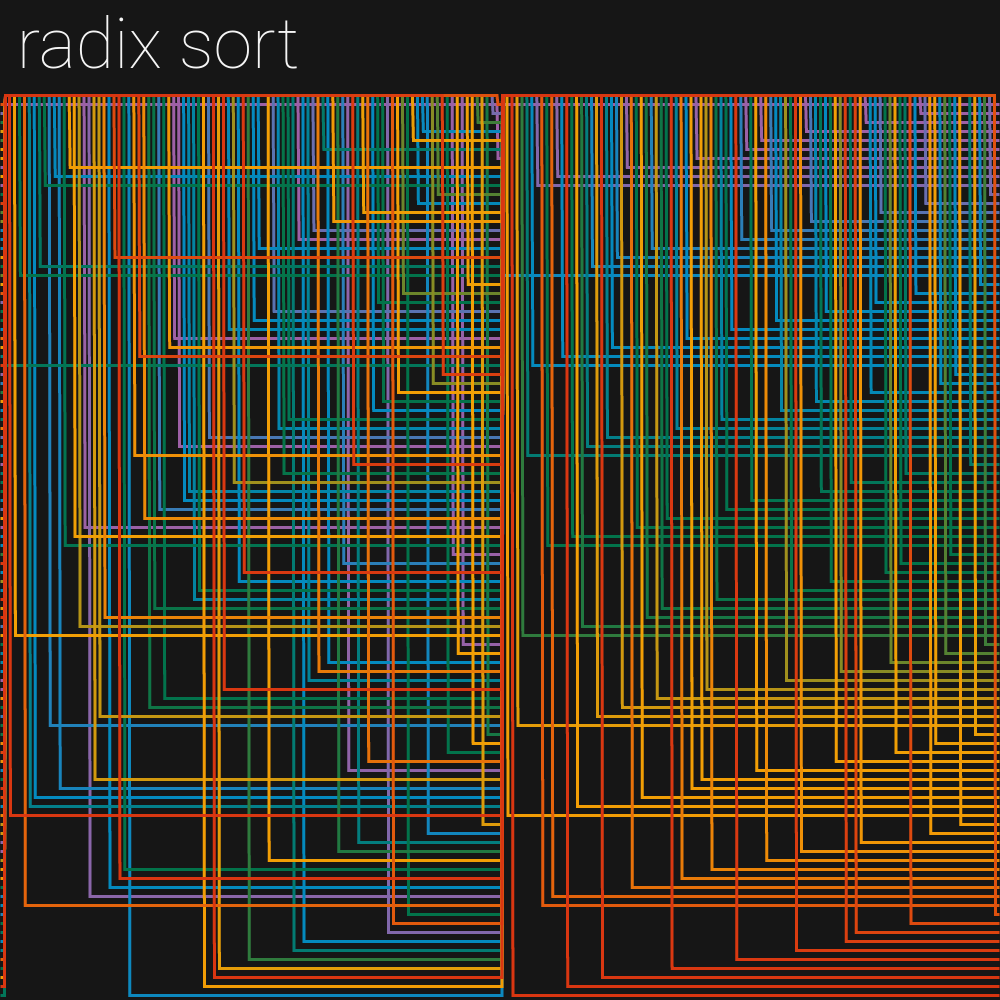
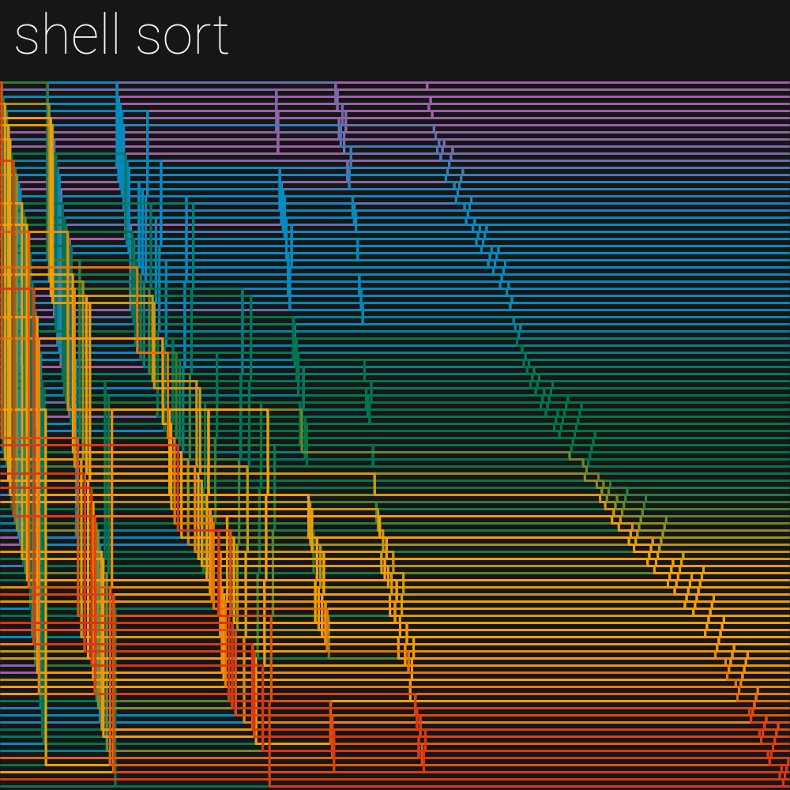
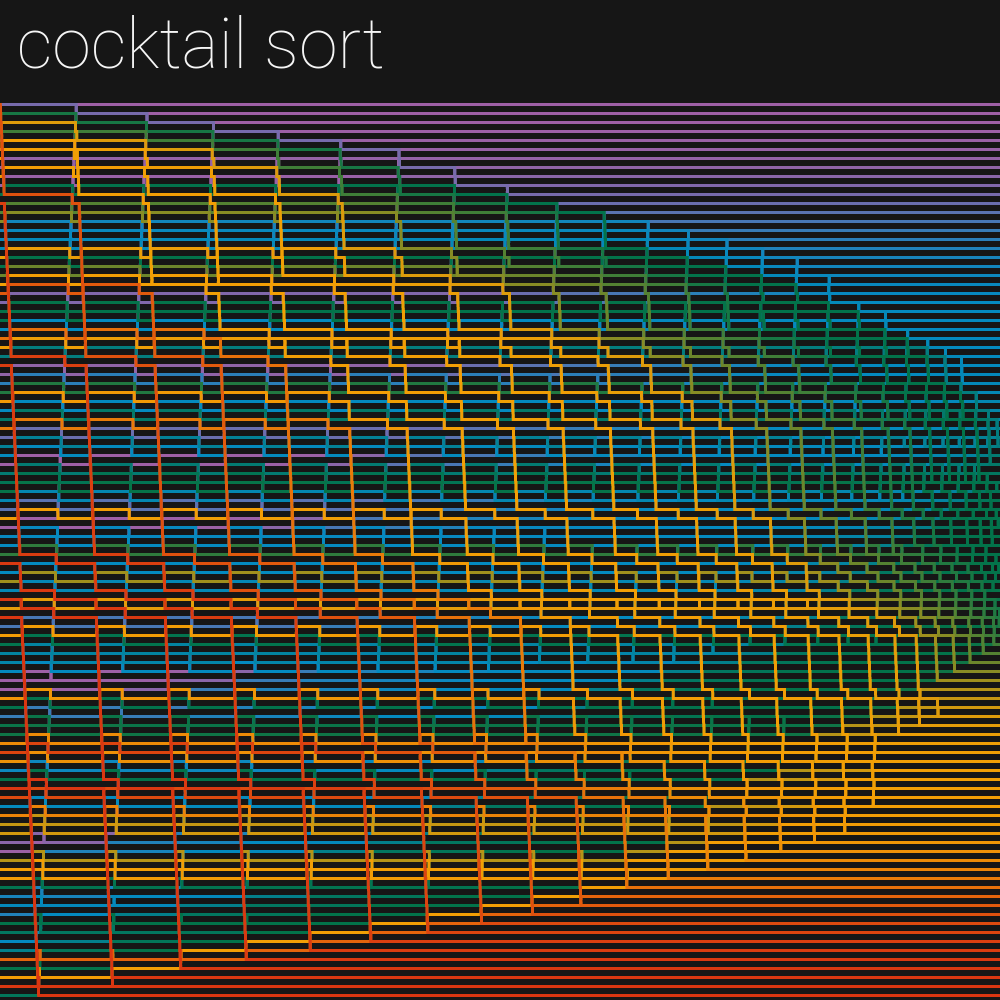

# SORTING VISUALIZATION

I wanted to visualize some sorting algorithm I have studied this semester in university, but I would not be satisfied with the kind of *bars moving on the screen with beep-boop noises* that I often watch on YouTube.
This concept has been around in my mind for quite some time, but I have not been able to create it for a while.

At each sorting step, the current state of the array is saved.
At the end the position of each element is tracked along consecutive steps of the algorithm.
The colour of each line is determined according to the value of the element, in a 5 colours palette that has been smoothed out.
By following a single line, you can see how the item moved in the array during the sorting process: some algorithms focus on single elements, while others look like they move items in groups.

Then I kinda lost myself and implemented many other sorting algorithms, including some that do not make sense at all *(for example, Gnome Sort)*.
Also, I have an exam coming up in two days and I am hitting that level of anxiety where I start procrastinating because I ran out of material to study.

Enjoy these images, featuring the sorting algorithms I have implemented.
The data ordered by each algorithm is the same in every picture.

I think it's pretty cool to see how each algorithm performs, and how each element is ordered.
Even from these simple images you can pretty much understand how these algorithms work and how fast they are.

You can also try the visualization [here](TODO) or you can look at other things I have made on my [Instagram profile](https://instagram.com/lorossi).

## Output

**Which of these pictures looks best?**

Bubble sort

Insertion sort

Selection sort

Merge sort

Quick sort

Counting sort

Heap sort

Radix sort

Bucket sort

Shell sort

Gnome sort

Pancake sort

Cocktail sort

Odd-even sort

Stooge sort

## Credits

This project is distributed under MIT license.
