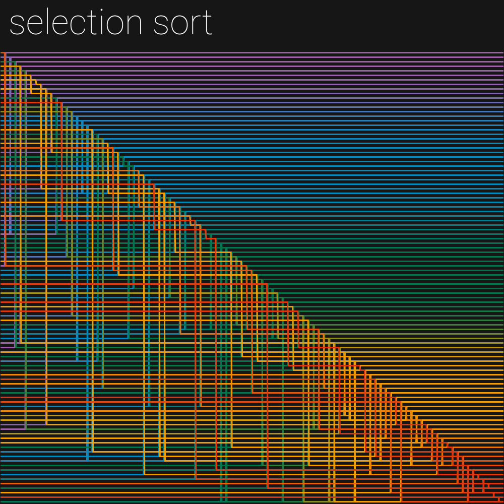
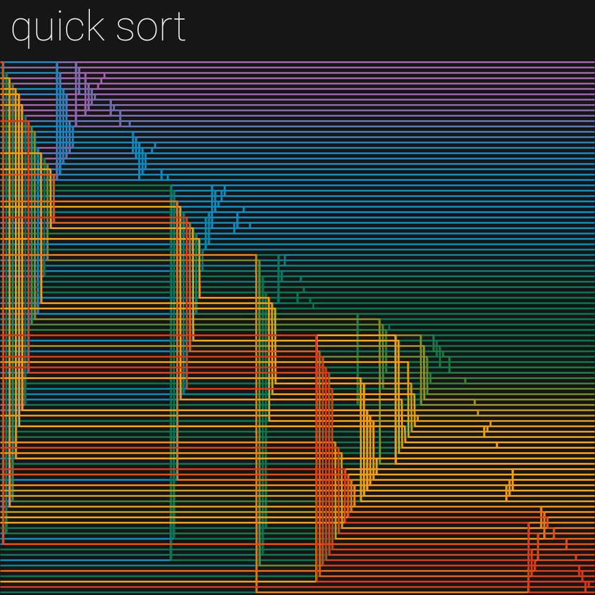

# SORTING VISUALIZATION

I wanted to visualize some sorting algorithm I have studied this semester in university.

Then I kinda lost myself and implemented many other sorting algorithms, including some that do not make sense at all.
Also, I have an exam coming up in two days and I am hitting that level of anxiety where I start procrastinating because I ran out of materials to study.

Enjoy these images.
All of them show a different sorting algorithm over the same data.

Which one is the best looking?

## Output

Bubble sort

Insertion sort

Selection sort

Merge sort

Quick sort

Counting sort

Heap sort

Radix sort

Bucket sort

Shell sort

Gnome sort

Pancake sort

Cocktail sort

Odd-even sort

Stooge sort

## Credits

This project is distributed under MIT license.
